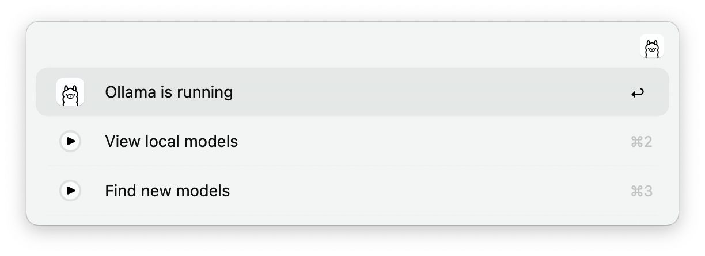
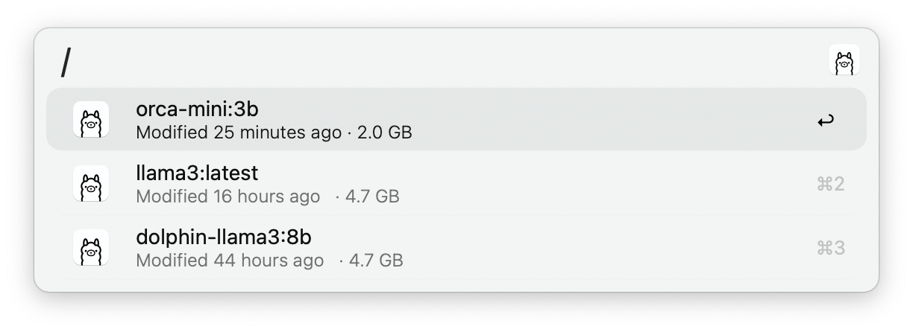
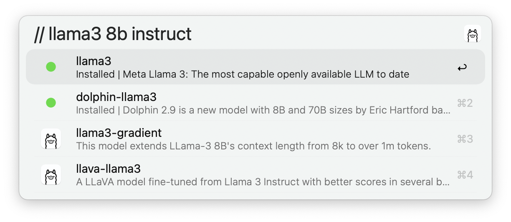
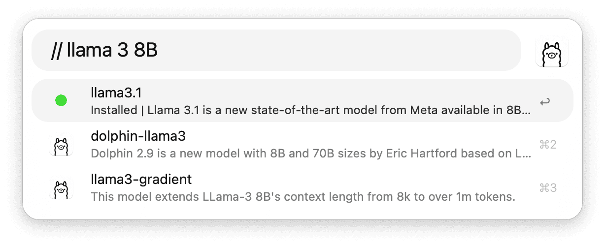
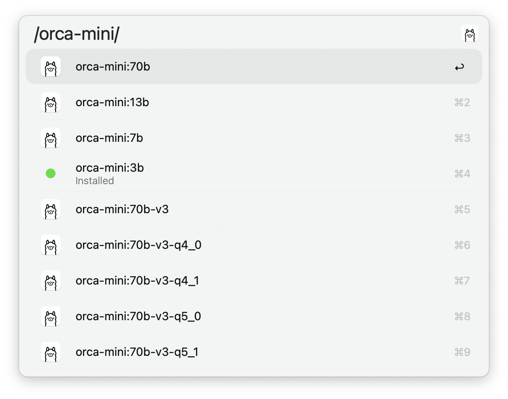
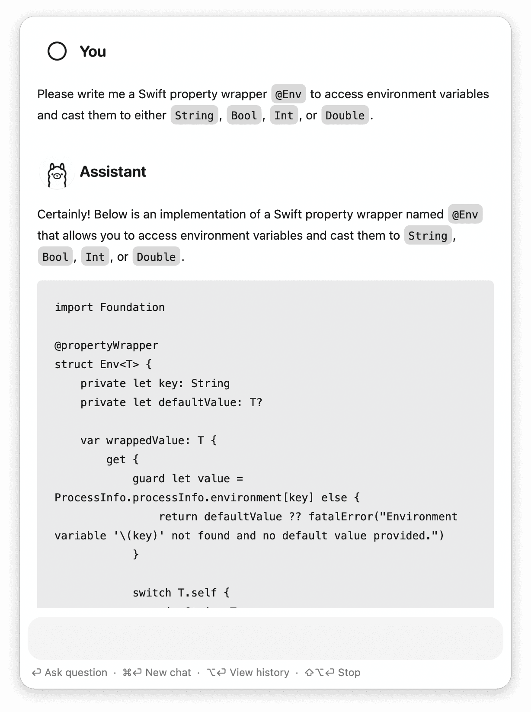
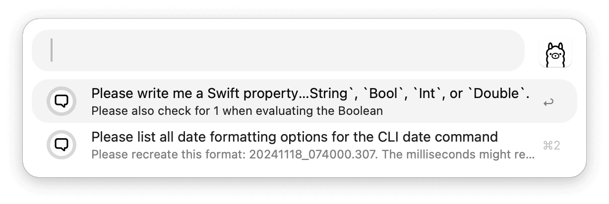
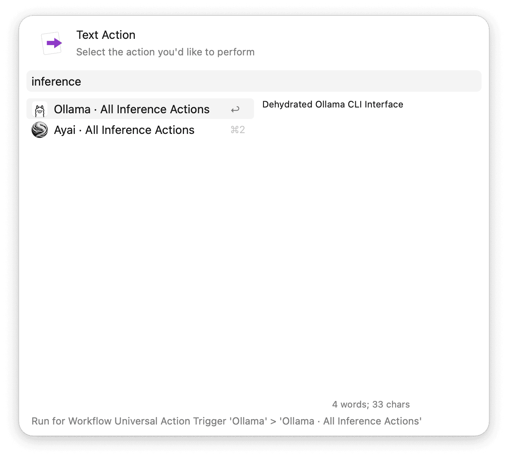
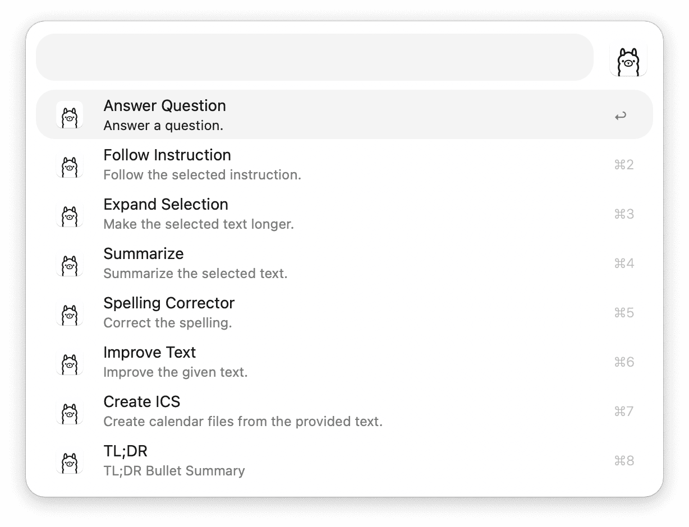

# Alfred Ollama

Dehydrated [Ollama](https://ollama.com/) Command Line Interface interface to
1. Manage your local language models
2. Perform local inference through Alfred

## Requirements

The Ollama [macOS application](https://ollama.com/download), at least one installed [model](https://ollama.com/library) for chat or other inference tasks, and the Xcode Command Line Tools.[^1] To modify or add custom inference actions to the workflow's [universal action](https://www.alfredapp.com/help/features/universal-actions/), install [pkl](https://pkl-lang.org/main/current/pkl-cli/index.html#homebrew), edit the configuration file and build the inference tasks.

## Usage

Manage your local models or chat with them via the `ollama` keyword. Alternatively, define [Hotkeys](https://www.alfredapp.com/help/workflows/triggers/hotkey/) for quick access.

- <kbd>↩</kbd> Continue conversation.
- <kbd>⌘</kbd><kbd>↩</kbd> Start or quit Ollama.
- <kbd>⌥</kbd> View Ollama version.

### Local Models

- <kbd>↩</kbd> Open the model page.
- <kbd>⇧</kbd> Quicklook preview the model page.
- <kbd>⌘</kbd><kbd>C</kbd> Copy the model name.
- <kbd>⌘</kbd><kbd>↩</kbd> Remove the model.
- <kbd>⌥</kbd><kbd>↩</kbd> Set as preferred model for inference.

### Loaded Models

- <kbd>⌘</kbd><kbd>↩</kbd> Unload the model.

### New Models

Type to match models based on your query.  
- <kbd>↩</kbd> Open the model page.
- <kbd>⇧</kbd> Quicklook preview the model page.
- <kbd>⌘</kbd><kbd>L</kbd> View the unabridged model description as large type.
- <kbd>⌘</kbd><kbd>C</kbd> Copy the model name.
- <kbd>⌘</kbd><kbd>↩</kbd> Pull `model:latest` from registry.
- <kbd>⌥</kbd><kbd>↩</kbd> (or tap <kbd>⇥</kbd>) Inspect available versions of the model.

### Model Versions

Type to match versions based on your query.  
- <kbd>↩</kbd> Open the model page.
- <kbd>⇧</kbd> Quicklook preview the model page.
- <kbd>⌘</kbd><kbd>C</kbd> Copy the model name.
- <kbd>⌘</kbd><kbd>↩</kbd> Pull `model:version` from registry.

### Pulling Models

- <kbd>⌘</kbd><kbd>↩</kbd> Cancel the download.

### Local Chat

#### Chat History

- <kbd>↩</kbd> Continue archived conversation.
- <kbd>⌥</kbd> View modification date.
- <kbd>⌘</kbd><kbd>↩</kbd> Reveal the chat file in Finder.
- <kbd>⌘</kbd><kbd>L</kbd> Inspect the unabridged preview as [Large Type](https://www.alfredapp.com/help/features/large-type/).
- <kbd>⌘</kbd><kbd>⇧</kbd><kbd>↩</kbd> Send conversation to the trash.

## Inference Actions

> Inference Actions provide a suite of language tools for text generation and transformation. These tools enable summarization, clarification, concise writing, and tone adjustment for selected text. They can also correct spelling, expand and paraphrase text, follow instructions, answer questions, and improve text in other ways. 

Access a list of all available actions via the [Universal Action](https://www.alfredapp.com/help/features/universal-actions/) or by setting the [Hotkey](https://www.alfredapp.com/help/workflows/triggers/hotkey/) trigger.

- <kbd>↩</kbd> __Stream__ the result to the frontmost application.

> [!IMPORTANT] 
> Make sure you only use this if the frontmost UI Element accepts text.  
> There are no security checks in place at the moment.

---

__Links:__  
* [ollama.com](https://ollama.com)
* [Ollama Github FAQ](https://github.com/ollama/ollama/blob/main/docs/faq.md)
* [Akazwz's ollama-models](https://github.com/akazwz/ollama-models)

__Footnotes__  
[^1]: `xcode-select --install`